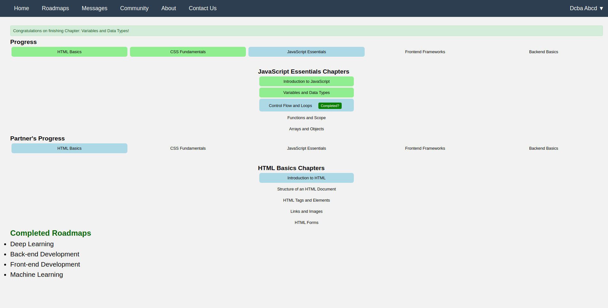
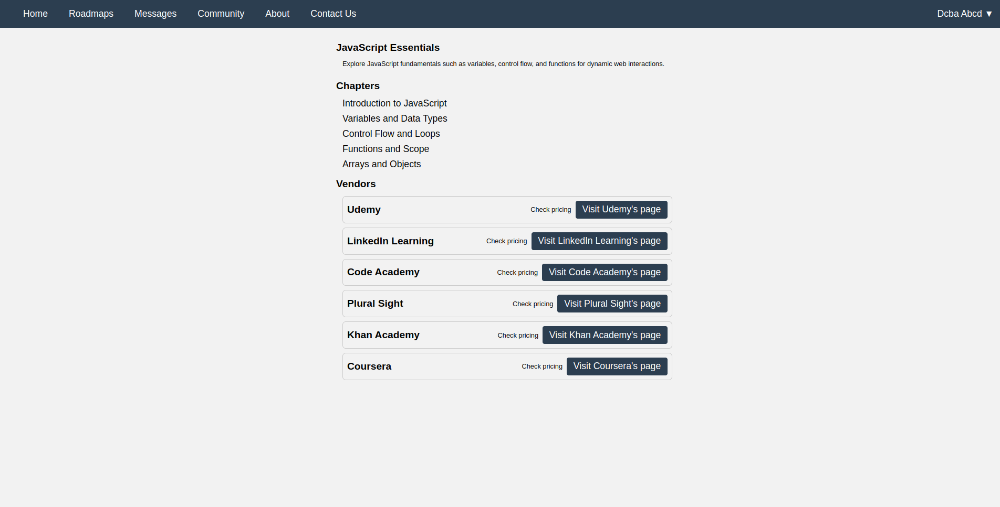
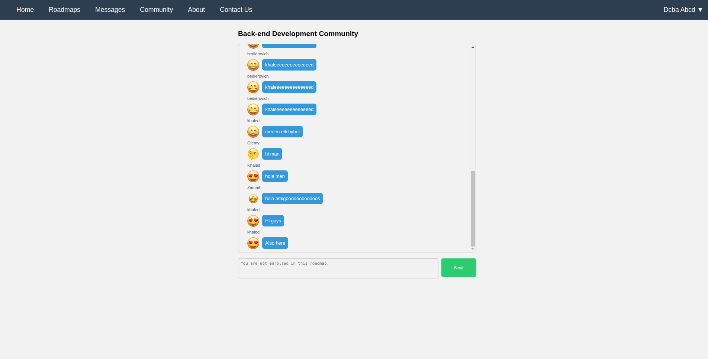
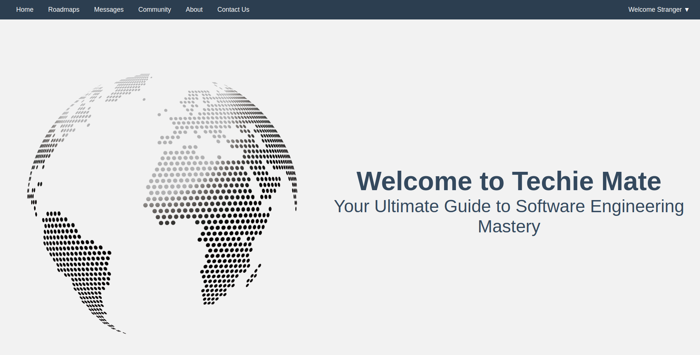

# techieMates

## Introduction

techieMates is a comprehensive platform designed to streamline and enhance the learning experience for tech enthusiasts and professionals. It provides a structured roadmap for various technology-related courses, enabling users to track their progress, engage with peers, and achieve their learning goals efficiently. Our mission is to make tech education accessible, enjoyable, and effective for everyone, regardless of their background or skill level.

### Deployed Site
You can visit the live version of techieMates at [techieMates](#).

### Blog Article
For an in-depth look at the development and features of techieMates, check out our [final project blog article](#).

### Author
**Khaled ElOlemy**
- [LinkedIn](https://linkedin.com/in/khaledolemy)
- [GitHub](https://github.com/khaledolemy)
- [Email](khaledolemy@gmail.com)

## Installation

To set up techieMates on your local machine, follow these steps:

1. **Clone the repository**
 ```bash
 git clone https://github.com/KhaledOlemy/techieMates.git
 ```
2. **Navigate to the project directory**
 ```bash
 cd techieMates
 ```
3. **Create a virtual environment**
 ```bash
 python3 -m venv venv
 ```
4. **Activate the virtual environment**
 - On Windows:
 ```bash
 venv/Scripts/activate
 ```
 - On macOS/Linux:
 ```bash
 source venv/bin/activate
 ```
5. **Install the required dependencies**
 ```bash
 pip install -r requirements.txt
 ```
6. **Set up the environment variables**
 Create a `.env` file in the project root directory and add the following environment variables:
 ```
 TM_API_HOST=0.0.0.0
 TM_API_PORT=5000
 SECRET_KEY=your_secret_key
 ```

7. **Run the application**
 ```bash
 flask run
 ```

## Usage

### Logging In
- Navigate to the login page and enter your credentials.
- If you don't have an account, you can sign up on the registration page.

### Dashboard
- After logging in, you'll be directed to your dashboard where you can view your current courses and progress.

### Courses
- Browse available courses and enroll in those that interest you.
- Track your progress through the course roadmap.

### Community
- Engage with other learners in the community section.
- Share your progress and collaborate on projects.

### Profile
- Update your profile information, including your photo and contact details.
- View your completed courses and achievements.

## Contributing

We welcome contributions to techieMates! If you'd like to contribute, please follow these steps:

1. Fork the repository.
2. Create a new branch for your feature or bug fix.
 ```bash
 git checkout -b feature-name
 ```
3. Make your changes.
4. Commit your changes with a descriptive commit message.
 ```bash
 git commit -m \"Description of the feature or fix\"
 ```
5. Push your branch to your forked repository.
 ```bash
 git push origin feature-name
 ```
6. Create a pull request from your branch to the main repository.

Please ensure your code adheres to our coding standards and includes appropriate tests.

## Related Projects

Here are some related projects that inspired techieMates:

- [Coursera](https://www.coursera.org/)
- [edX](https://www.edx.org/)
- [Udacity](https://www.udacity.com/)

## Licensing

techieMates is licensed under the MIT License. See the [LICENSE](LICENSE) file for more details.

## Project Inspiration and Vision

The inspiration for techieMates came from my own experiences as a tech learner. I realized that while there are many resources available, there was no single platform that offered a structured, community-driven learning experience. I wanted to create a platform that not only provides high-quality courses but also fosters a sense of community and collaboration among learners.

### Challenges

One of the main challenges in developing techieMates was integrating various features such as course management, user authentication, and community engagement into a seamless user experience. Balancing the technical complexity with user-friendliness required careful planning and iterative development.

### Future Vision

In future iterations, I envision techieMates expanding its course offerings and incorporating advanced features such as personalized learning paths, AI-driven progress tracking, and real-time collaboration tools. I also aim to partner with industry experts to provide exclusive content and certifications.

## Screenshots and Visuals


*The techieMates dashboard provides an overview of your courses and progress.*


*Detailed course pages with progress tracking and community engagement.*


*Engage with peers and collaborate on projects in the community section.*


*The Landing page of the website.*

## Technical Details

techieMates is built using Flask, a lightweight web framework for Python. The backend leverages SQLAlchemy for database interactions, and Flask-Login for user authentication. The front end is developed using HTML, CSS, and JavaScript, providing a responsive and interactive user experience.

### Key Features

- **User Authentication**: Secure login and registration using Flask-Login and bcrypt for password hashing.
- **Course Management**: Create, update, and manage courses with a structured roadmap.
- **Progress Tracking**: Monitor user progress through courses and provide feedback.
- **Community Engagement**: Forums and messaging for user interaction and collaboration.

### Algorithms and Design

techieMates employs various algorithms and design patterns to enhance performance and scalability. The use of SQLAlchemy ORM facilitates efficient database operations, while the Flask blueprints pattern helps organize the application structure.

## Conclusion

techieMates is more than just a learning platform; it's a community for tech enthusiasts to grow and thrive together. I am proud of what I've accomplished with techieMates and am excited about its future potential. Your feedback and contributions are invaluable in making techieMates the best it can be.

Thank you for your interest and support!

Happy Learning!

Khaled ElOlemy
